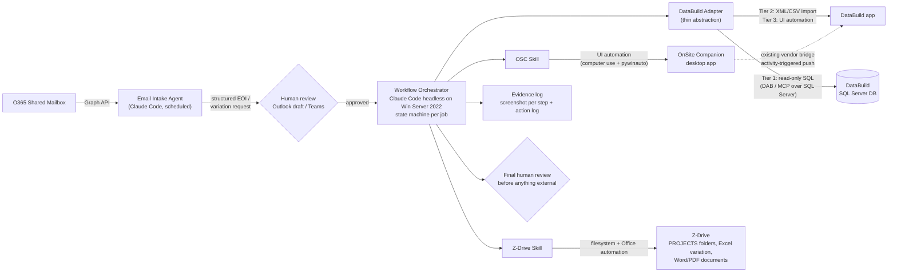

# Contract Admin Automation with Claude Code (Windows Server 2022)

## Problem

Automate two contract-admin workflows for the builder client, executed today as manual UI work in OnSite Companion (OSC), Z-Drive and DataBuild:

1. **New Job Creation** (per *OSC new job manual*): EOI email intake → OSC job creation and job details → Z-Drive folder → DataBuild handoff (via Lisa) → contact details → plan-arrival updates.
2. **Variation Stage 1** (per *Creating a Variation* manual): variation type decision → OSC variation + workflow templates (9.1/9.2 or 9.4) → Z-Drive Excel variation (VAR-#####001) → OSC Detailed Description + Generate Document → PDF filing into OSC → staff alert.

## Key Research Finding

**DataBuild has no public API.** It is a legacy 32-bit VB Windows app backed by MS Access (small installs) or SQL Server 2012–2022 (larger installs). All known third-party integrations work at the database level (PlanSwift DBxConnector reads the live SQL DB), via built-in XML/CSV import-export routines, or through the native OSC↔DataBuild partner bridge (Companion Systems, since 2012). The discovery-session claim "DataBuild has an API" almost certainly refers to DB-level or file-based integration. OSC's own integration surface also remains unconfirmed (open risk — confirm with IT specialist Adam).

## Architecture

Two-tier integration per system — structured access where possible, UI automation fallback where not. Everything runs locally on the client's Windows Server 2022 (on-prem data constraint).



## Integration Tiers per System

### OnSite Companion (highest risk — validate first)

- Investigate API / DB-level access with Adam (ODBC/SQL, existing integration layer).
- Fallback (assumed baseline): Windows UI automation driven by Claude Code — computer-use screenshots for verification plus `pywinauto`/UIA scripts for deterministic clicks and field entry. Every step logged with a screenshot.

### DataBuild (no public API)

Behind a thin adapter interface (`pricing.get()`, `variation.create()`, …) so it can be swapped when "Estimating Companion" replaces it:

- **Tier 1 — read-only SQL**: confirm SQL Server backend with Adam; stand up Microsoft Data API Builder (free, on-prem, REST + MCP over SQL Server) or a small custom MCP server against the DataBuild DB. Covers price double-check (new-job step 11) and variation pricing lookups. Validate against a backup/test copy first.
- **Tier 2 — native import routines**: DataBuild ships XML/CSV import-export; Claude Code generates import files for structured writes (e.g. variation entry, killing the duplicate re-entry pain point). Confirm spec with DataBuild support (1300 015 153).
- **Tier 3 — UI automation**: same tooling as OSC, as last resort.
- **Leverage the existing OSC→DataBuild vendor bridge**: entering data once in OSC may propagate automatically; confirm scope with Companion Systems (02 9635 0000).

### Z-Drive (lowest risk — pure filesystem/Office automation)

- Job folder cloning per template taxonomy; variation folder `.../ESTIMATING/1. SALES/2. VARIATIONS/VAR-00X/`.
- Excel variation template copy + rename (`VAR-#####001`) and item fill via `openpyxl`/Office COM.
- Word/PDF generation support and executed-document filing.

### Office 365 (native API)

- Graph API against the shared contract-admin mailbox: scheduled poll or webhook; structured extraction of EOI / variation request fields per schema; low-confidence extractions flagged for human confirmation.

## Repo Layout

```
.claude/
  CLAUDE.md                 # guardrails, HITL policy, naming conventions (CAPS rules, VAR numbering)
  commands/
    intake-eoi.md           # /intake-eoi — parse EOI email into structured job JSON
    osc-new-job.md          # /osc-new-job — run new-job workflow from job JSON
    osc-variation.md        # /osc-variation <job-no> <type> — run Variation Stage 1
  skills/
    onsite-companion/       # OSC UI step library (open job, add variation, complete activity, attach doc, add alert)
    zdrive/                 # folder + Excel/Word/PDF operations
    databuild/              # adapter: sql-read / import / ui tiers
    outlook/                # Graph API mailbox + draft creation
rules/
  job-details.md            # distilled OSC manual rules: address format (New Road vs registered), suburb CAPS,
                            #   QLD=Buildable, council lookup, design-type mapping, marketer/sales relationship strings
  variation-rules.md        # VAR-001 vs VAR-021 numbering, summary wording, template 9.1/9.2/9.4 selection,
                            #   file naming VAR-#####001, Sales Docs attach + Move, alert recipient rules
state/                      # per-job state machine JSON, idempotent resumable checkpoints
evidence/                   # per-run screenshots + action logs for review/audit
```

## Workflow Design

### Workflow 1 — New Job

1. Intake: parse EOI email (client, lot/address, estate, state, design, marketer, sales) → job JSON; search OSC by lot number to prevent duplicates.
2. Human review gate: draft summary for morning review.
3. OSC job creation: region, generated contract no., Pre Sales Investor v1 template, client creation.
4. Job details entry per `rules/job-details.md` (address logic, suburb/postcode verification via web lookup, council lookup, certifier=Buildable for QLD, marketer CAPS conventions).
5. Activities 1, 2, 6 completed; request email attached to JOB and Item 11 with `NEW JOB` subject (uppercase enforced).
6. DataBuild handoff: email Lisa (draft) — later replaced/augmented by Tier 1 SQL price verification when Lisa's entry lands.
7. Contact details: client (primary/secondary rules), SALES and `MARKETER_ cc in all emails` relationships.
8. Plan arrival (Item 12): update street/design/facade/inclusions per PLANS, garage side mapping (else escalate to Michael).

### Workflow 2 — Variation Stage 1

1. Determine type: Post Contract / Building (VAR-001+) vs Internal (VAR-021+); pick next number from OSC.
2. OSC: add variation (reference, summary wording per type), attach workflow template 9.1 or 9.4; complete activities; append 9.2 when prompted.
3. Z-Drive: create VAR-00X folder, copy + rename template `VAR-#####001`, fill items with spacing rules, compute GST totals.
4. OSC: paste items into Detailed Description; Generate Document with matching template (Post Contract/Building/Internal); human review of Word doc; save PDF `VAR-#####001`.
5. Attach PDF into OSC Variation Documents (Sales Docs, Move), Save & Refresh; tick activities up to 'Send Variation Document to Client'; add Alert to the responsible staff member.
6. Human review gate before anything is sent to the owner.

## Human-in-the-Loop

Every externally visible artefact (job record summary, variation doc, alert, DocuSign later) is produced as a draft with an evidence bundle (screenshots + diffs) for morning review; on approval the agent completes the remaining ticks automatically. Autonomy tightens progressively per the client's staged trust model.

## Rollout Sequencing

1. **Validate OSC integration surface** with Adam (API/DB/UI-only) — critical path. Build and demo the UI-automation step library on a test job.
2. **DataBuild validation spike (1–2 days)**: confirm SQL vs Access; read-only DAB/MCP against a test copy; ask DataBuild support for import spec; ask Companion Systems what the OSC→DataBuild push covers.
3. **Email intake pipeline** end-to-end with a self-addressed test EOI.
4. **Workflow 1 (New Job)** assisted mode with review gates.
5. **Workflow 2 (Variation Stage 1)** — reuses OSC step library + Z-Drive skill.
6. Later phases: DocuSign API, Z-Drive RAG knowledge layer, follow-up tracking.

## Key Risks

- OSC automation surface unproven — UI automation of a legacy VB app can be brittle (window titles, modal dialogs, grid controls); mitigate with pywinauto/UIA (not pure pixel clicking), per-step verification screenshots, and resumable state.
- DataBuild SQL writes are unsafe until schema is understood — start read-only; prefer import routines or the OSC bridge for writes.
- DataBuild replacement in 6–12 months — all access behind the thin adapter.
- On-prem compliance — orchestrator, MCP servers and all data stay on the client's server; only Graph/DocuSign cloud APIs are called for their own data.
- Claude Code on Windows Server 2022 runs natively; UI automation requires an unlocked interactive session (console session or persistent RDP with disconnect-keeps-session policy) — needs IT setup. See [02-windows-server-setup.md](02-windows-server-setup.md).
