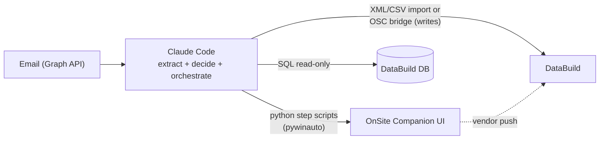

# Runtime Automation Flow

How Claude Code, Python UI automation, SQL access and import routines fit together when processing an email into OSC and DataBuild.

## Division of labour

Claude Code does **not** move the mouse itself. It:

1. Reads the EOI / variation email (Graph API) and extracts structured data.
2. Applies judgment: variation type, workflow template selection, address/council lookups, escalations (e.g. garage side → Michael).
3. Calls pre-built, deterministic **Python step scripts** (e.g. `osc_create_job.py --data job.json`) that drive the OSC desktop UI via `pywinauto`.
4. Verifies each step from screenshots and recovers when the UI does something unexpected.

Scripted steps are fast and repeatable; Claude's judgment handles extraction, decisions, and recovery.

## Per-system paths

### OnSite Companion — UI automation (yes)

All OSC work (create job, fill fields, complete activities, attach documents, add alerts) goes through the Python step-script library, with per-step screenshot evidence.

### DataBuild — UI automation is the last resort

Preferred order:

1. **Reads** (price checks, lookups) → direct **read-only SQL** against the DataBuild database. No UI at all.
2. **Writes** (new jobs, variations) → DataBuild's native **XML/CSV import routines**, or ideally the existing **OSC→DataBuild vendor bridge** (data entered once into OSC gets pushed automatically — confirm coverage with Companion Systems).
3. Only if neither works → Python UI automation, same tooling as OSC (Tier 3).

## Flow diagram

## Human in the loop

The review gate sits **between extraction and data entry**: Claude drafts what it is about to enter (with the evidence bundle), a person approves during morning review, then the step scripts run. Nothing is sent externally without approval.
