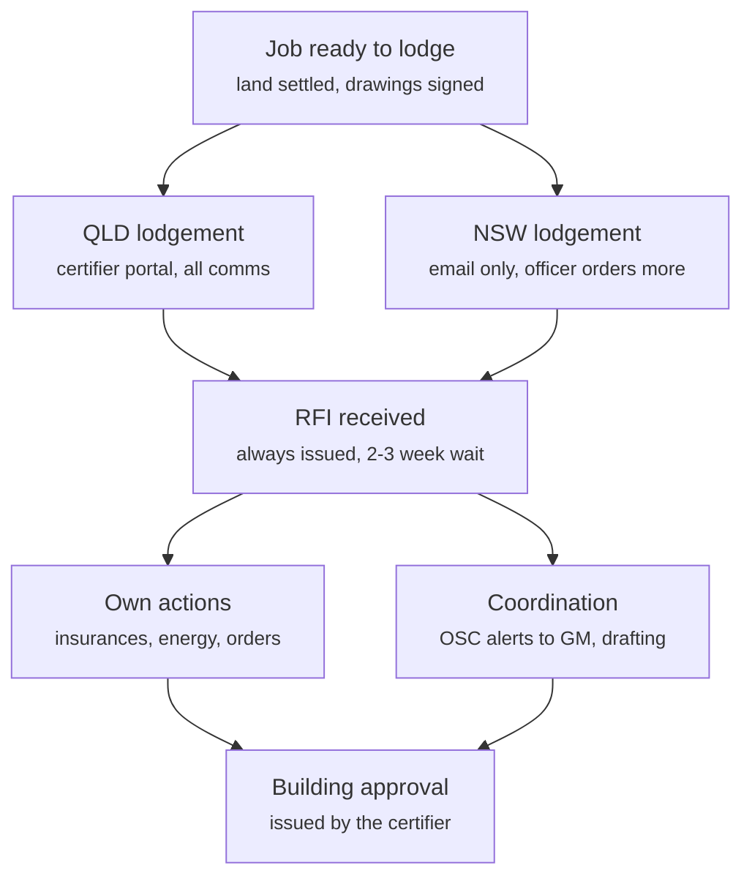
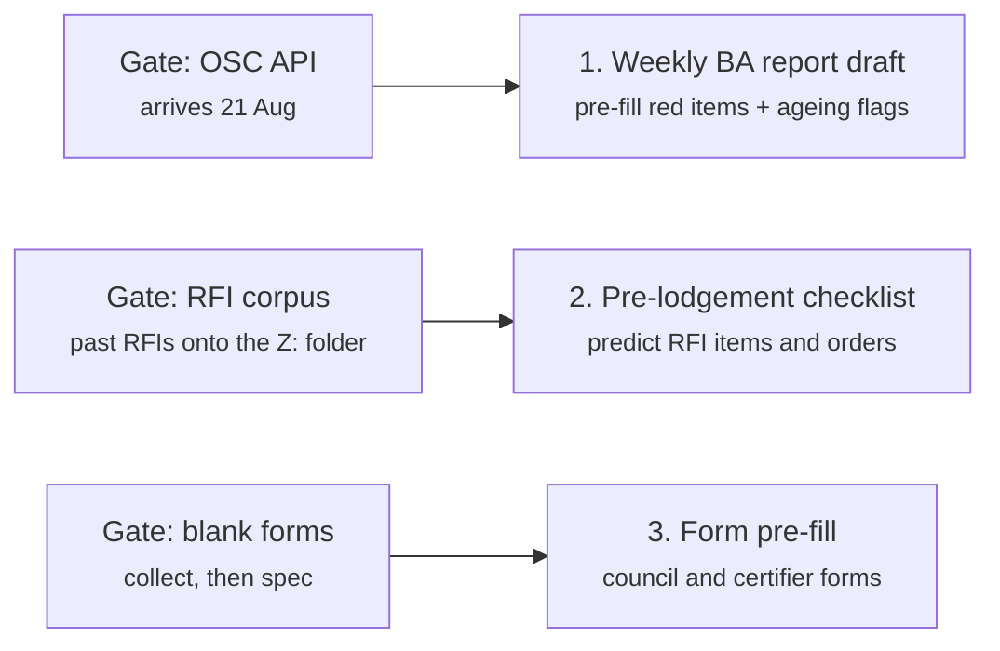

# Brainstorm: permit officer approvals automation

Source: AI-consultation discovery meeting, 20 Aug 2026 (recording + transcript
kept outside the repo — client PII). De-identified extraction; the resulting
implementation plan is
[../plans/2026-08-20-permit-officer-approvals-automation.md](../plans/2026-08-20-permit-officer-approvals-automation.md).

## The approval workflow (as run today)

Notes from discovery:

- Lodgement itself is quick — the package (soil report, contours, registered
  plans, contract) is already in OSC's Document Manager. The pain starts at
  RFI stage.
- QLD: the certifier's portal holds the whole conversation and the certifier
  places most orders. NSW: no portal, everything is email, and the officer
  additionally orders the s10.7 certificate, water-authority approvals, and
  lodges via the NSW Planning Portal — NSW is the hard tracking case.
- Internal comms are always OSC alerts on the job (visible to everyone);
  external comms are email, dragged into OSC as `.msg` unless sent from OSC.
- The energy assessment nearly always returns required upgrades → GM
  decision → variation.
- Tracking all of this by hand feeds the **Monday weekly BA report** — every
  outstanding item re-derived job-by-job from OSC, the QLD portal, and the
  mailbox. That report is the single biggest time sink named in the meeting.

## Automation targets and their gates

## Fixed non-goals (agreed in the meeting)

- No AI judgement on RFI responses — analysis and decisions stay with the
  permit officer.
- No automation of certifier / council / NSW Planning / utility portals — no
  credentials to AI.
- DataBuild is retiring and out of scope.
