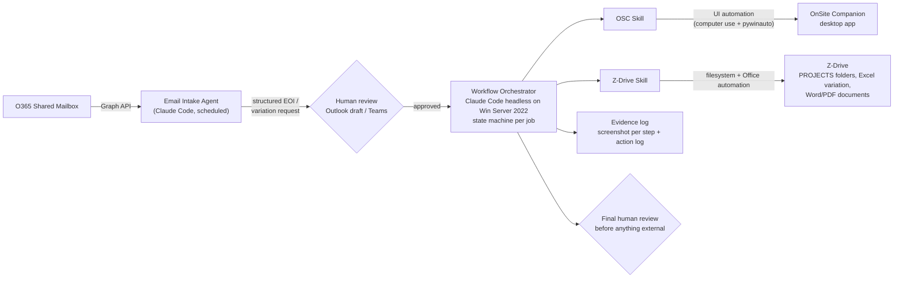

# Contract Admin Automation with Claude Code (Windows Server 2022)

> **Status (Aug 2026):** this is the discovery-phase design and it aims further
> than what is built. What exists today is the contract-documents workflow
> (`/new-contract-template`) — which isn't in this document at all, as it was
> scoped after discovery. The new-job intake (`/ca-new-job`) described under
> Workflow 1 was built draft-only and then retired (18 Aug 2026) in favour of
> `/new-contract-template`; Workflow 1 below is kept as the design record. The
> OSC write-automation below is deferred pending the technical session with
> Adam. The **DataBuild integration was closed 23 Aug 2026** — DataBuild
> confirmed it provides no API access, so the adapter/tier design below is
> superseded and kept only as the record (see the Key Research Finding for
> what DataBuild is and the closure note under Integration Tiers). Current state:
> [../README.md](../README.md); layout: [architecture-overview](../../../docs/architecture-overview.md).

## Problem

Automate two contract-admin workflows for the builder client, executed today as manual UI work in OnSite Companion (OSC), Z-Drive and DataBuild:

1. **New Job Creation** (per *OSC new job manual*): EOI email intake → OSC job creation and job details → Z-Drive folder → DataBuild handoff (via Lisa) → contact details → plan-arrival updates.
2. **Variation Stage 1** (per *Creating a Variation* manual): variation type decision → OSC variation + workflow templates (9.1/9.2 or 9.4) → Z-Drive Excel variation (VAR-#####001) → OSC Detailed Description + Generate Document → PDF filing into OSC → staff alert.

## Key Research Finding

**DataBuild provides no API access — vendor-confirmed, 23 Aug 2026.** The
discovery-phase research already found no *public* API: DataBuild is the
builder's estimating and job-costing package (price files and cost centres,
job pricing, progress-claim schedules, purchase orders — the source of the
contract price figures in CD-5.4), a legacy 32-bit VB Windows app backed by
MS Access (small installs) or SQL Server 2012–2022 (larger installs). Known
third-party integrations worked at the database level (PlanSwift DBxConnector
reads the live SQL DB), via built-in XML/CSV import-export routines, or
through the native OSC↔DataBuild partner bridge (Companion Systems, since
2012). DataBuild has since confirmed it does not provide API access, which
closes the DB-level/MCP route too: no MCP server, adapter, or import
automation can be stood up against it. DataBuild stays a manual system (a
person keys its figures, JD-6/CD-5.4) and is retiring in favour of Estimator
Companion (per the 20 Aug 2026 permit-officer record). OSC's own integration
surface remains unconfirmed (open risk — confirm with IT specialist Adam
Wordrop).

## Architecture

Two-tier integration per system — structured access where possible, UI automation fallback where not. Everything runs locally on the client's Windows Server 2022 (on-prem data constraint).

DataBuild sits **outside** the automated flow: it has no integration surface
(no API access, vendor-confirmed), so its only touchpoints are drafts for a
person — the JD-6 handoff email to the DataBuild administrator, and figures a
person keys into the job JSON (CD-5.4). An earlier revision of this diagram
had a "DataBuild Adapter" with SQL/import/UI tiers; that design is closed —
see below.

## Integration Tiers per System

### OnSite Companion (highest risk — validate first)

- Investigate API / DB-level access with Adam (ODBC/SQL, existing integration layer).
- Fallback (assumed baseline): Windows UI automation driven by Claude Code — computer-use screenshots for verification plus `pywinauto`/UIA scripts for deterministic clicks and field entry. Every step logged with a screenshot.

### DataBuild — no integration (closed 23 Aug 2026)

**Superseded.** The tiered adapter designed here — a thin abstraction
(`pricing.get()`, `variation.create()`, …) over read-only SQL via Microsoft
Data API Builder or a custom MCP server (Tier 1), native XML/CSV import
routines (Tier 2), UI automation (Tier 3), and the OSC→DataBuild vendor
bridge — was dropped when DataBuild confirmed it provides **no API access**.
There is nothing to stand an MCP server or adapter on, so none was built and
none will be. DataBuild interaction stays manual: the JD-6 email handoff to
the DataBuild administrator, the JD-6.2 price double-check, and figures a
person keys into the job JSON before a contract fill (CD-5.4). With DataBuild
also retiring in favour of Estimator Companion, there is no reason to revisit.
What the tool is and does is recorded under Key Research Finding above.

### Z-Drive (lowest risk — pure filesystem/Office automation)

- Job folder cloning per template taxonomy; variation folder `.../ESTIMATING/1. SALES/2. VARIATIONS/VAR-00X/`.
- Excel variation template copy + rename (`VAR-#####001`) and item fill via `openpyxl`/Office COM.
- Word/PDF generation support and executed-document filing.

### Office 365 (native API)

- Graph API against the shared contract-admin mailbox: scheduled poll or webhook; structured extraction of EOI / variation request fields per schema; low-confidence extractions flagged for human confirmation.

## Repo Layout

Superseded. The repo was reorganised by job-role after this document was
written, and the layout sketched here (root `rules/`, `state/`, `evidence/`,
one skill per system) is **not** what was built. The current layout is in
[docs/architecture-overview.md](../../../docs/architecture-overview.md), and
runtime state / evidence live outside git under
`runtime\contract-admin\` (see the org [CLAUDE.md](../../../CLAUDE.md)).

## Workflow Design

### Workflow 1 — New Job

1. Intake: parse EOI email (client, lot/address, estate, state, design, marketer, sales) → job JSON; search OSC by lot number to prevent duplicates.
2. Human review gate: draft summary for morning review.
3. OSC job creation: region, generated contract no., Pre Sales Investor v1 template, client creation.
4. Job details entry per `rules/job-details.md` (address logic, suburb/postcode verification via web lookup, council lookup, certifier=Buildable for QLD, marketer CAPS conventions).
5. Activities 1, 2, 6 completed; request email attached to JOB and Item 11 with `NEW JOB` subject (uppercase enforced).
6. DataBuild handoff: email Lisa (draft); the price double-check when her confirmation lands stays manual (JD-6.2 — no DataBuild integration exists).
7. Contact details: client (primary/secondary rules), SALES and `MARKETER_ cc in all emails` relationships.
8. Plan arrival (Item 12): update street/design/facade/inclusions per PLANS, garage side mapping (else escalate to Michael).

### Workflow 2 — Variation Stage 1

1. Determine type: Post Contract / Building (VAR-001+) vs Internal (VAR-021+); pick next number from OSC.
2. OSC: add variation (reference, summary wording per type), attach workflow template 9.1 or 9.4; complete activities; append 9.2 when prompted.
3. Z-Drive: create VAR-00X folder, copy + rename template `VAR-#####001`, fill items with spacing rules, compute GST totals.
4. OSC: paste items into Detailed Description; Generate Document with matching template (Post Contract/Building/Internal); human review of Word doc; save PDF `VAR-#####001`.
5. Attach PDF into OSC Variation Documents (Sales Docs, Move), Save & Refresh; tick activities up to 'Send Variation Document to Client'; add Alert to the responsible staff member.
6. Human review gate before anything is sent to the owner.

## Human-in-the-Loop

Every externally visible artefact (job record summary, variation doc, alert, DocuSign later) is produced as a draft with an evidence bundle (screenshots + diffs) for morning review; on approval the agent completes the remaining ticks automatically. Autonomy tightens progressively per the client's staged trust model.

## Rollout Sequencing

1. **Validate OSC integration surface** with Adam (API/DB/UI-only) — critical path. Build and demo the UI-automation step library on a test job.
2. **Email intake pipeline** end-to-end with a self-addressed test EOI.
3. **Workflow 1 (New Job)** assisted mode with review gates.
4. **Workflow 2 (Variation Stage 1)** — reuses OSC step library + Z-Drive skill.
5. Later phases: DocuSign API, Z-Drive RAG knowledge layer, follow-up tracking.

*(A "DataBuild validation spike" once sat second on this list; it was removed
when DataBuild confirmed no API access — there is nothing to validate.)*

## Key Risks

- OSC automation surface unproven — UI automation of a legacy VB app can be brittle (window titles, modal dialogs, grid controls); mitigate with pywinauto/UIA (not pure pixel clicking), per-step verification screenshots, and resumable state.
- DataBuild figures reach the workflow only through a person keying them (CD-5.4) — a typo there flows into the contract data sheet; the JD-6.2 price double-check is the control.
- On-prem compliance — orchestrator, MCP servers and all data stay on the client's server; only Graph/DocuSign cloud APIs are called for their own data.
- Claude Code on Windows Server 2022 runs natively; UI automation requires an unlocked interactive session (console session or persistent RDP with disconnect-keeps-session policy) — needs IT setup. See [02-windows-server-setup.md](02-windows-server-setup.md).
