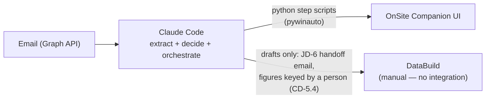

# Runtime Automation Flow

How Claude Code and Python UI automation fit together when processing an email into OSC. DataBuild sits outside the automated flow entirely — it has no API access (vendor-confirmed 23 Aug 2026), so its touchpoints are drafts and keyed values for a person, never automation.

## Division of labour

Claude Code does **not** move the mouse itself. It:

1. Reads the EOI / variation email (Graph API) and extracts structured data.
2. Applies judgment: variation type, workflow template selection, address/council lookups, escalations (e.g. garage side → Michael).
3. Calls pre-built, deterministic **Python step scripts** (e.g. `osc_create_job.py --data job.json`) that drive the OSC desktop UI via `pywinauto`.
4. Verifies each step from screenshots and recovers when the UI does something unexpected.

Scripted steps are fast and repeatable; Claude's judgment handles extraction, decisions, and recovery.

## Per-system paths

### OnSite Companion — UI automation (yes)

All OSC work (create job, fill fields, complete activities, attach documents, add alerts) goes through the Python step-script library, with per-step screenshot evidence.

### DataBuild — manual only (no integration)

DataBuild confirmed (23 Aug 2026) that it provides no API access, so there is
no automated path: no SQL reads, no XML/CSV import routines, no MCP server.
(An earlier revision of this doc set out a preferred order of SQL reads,
import-routine writes, and UI automation as last resort — all closed.) Every
DataBuild touchpoint stays with a person:

- **New-job handoff** — an email to the DataBuild administrator, drafted for
  human review (JD-6); the price double-check when the confirmation returns is
  manual too (JD-6.2).
- **Contract figures** — a person keys the DataBuild figures into the job JSON
  before a fill; the fill scripts never compute or fetch them (CD-5.4).

DataBuild is also retiring in favour of Estimator Companion, so no automation
against it will be built. Background on what the tool is:
[01-solution-architecture.md](01-solution-architecture.md).

## Flow diagram

## Human in the loop

The review gate sits **between extraction and data entry**: Claude drafts what it is about to enter (with the evidence bundle), a person approves during morning review, then the step scripts run. Nothing is sent externally without approval.
