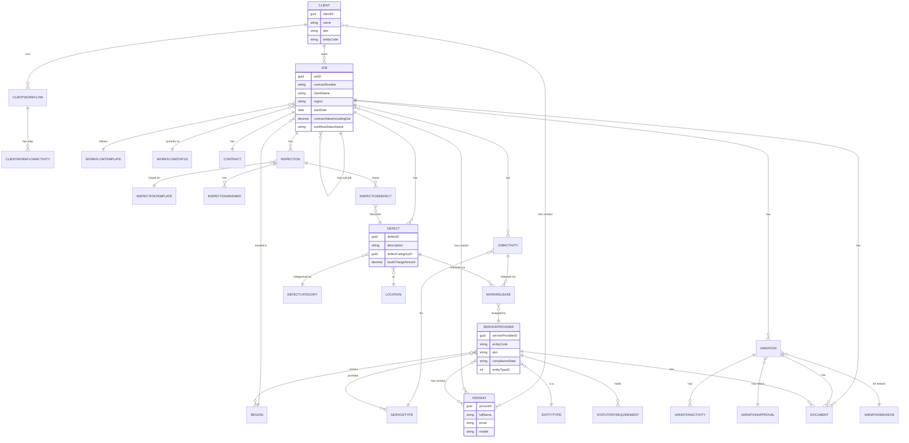

# osc-api MCP server

A local (stdio) MCP server that bridges Claude Code to the **Companion Systems
OSC API** (OSCAPI). It gives skills and sessions a small set of tools to query
OSC data and, once deliberately enabled, to write to it - with the org
human-in-the-loop rules enforced.

This is **code only**. No credentials or server names live here; everything that
identifies an environment is supplied through `OSC_*` environment variables, so
the same server points at **dev** or **production** by changing the environment,
not the code.

## OSC object model (what you can query)

The entities OSC exposes and how they relate, derived from the API's route
hierarchy. **Job is the hub**: it owns its variations, defects, inspections,
workflow activities, contacts and documents. Service providers (trades) connect
to work through **work releases**. This is what the tools below reach.



Cardinality reads left-to-right: `||--o{` is one-to-many, `}o--||`
many-to-one, `}o--o{` many-to-many, `||--||` one-to-one.

**Cross-cutting and reference data** (not drawn, to keep the diagram legible):
- **Alerts** and **Messages** attach polymorphically to jobs, job activities,
  defects and client-workflow activities; **Documents** attach to jobs,
  variations, defects, messages, work releases and service providers.
- **Users** (with roles), **Orders**, **StoppageRequests**, **ClientLogs**, and
  the **Liink** / **MobileApp** channels are additional top-level capabilities.
- **Lookups**: Region, Service, ServiceType, DocumentType, DefectCategory,
  Location, StatutoryRequirement, EntityType, WorkflowStatus, WorkflowTemplate,
  VariationReason, VariationApproval, plus the `Miscellaneous/*` enums.

## Tools

| Tool | Kind | What it does |
|---|---|---|
| `osc_token_info` | read | Granted OAuth scope + token expiry for the current credential. Start here to check connectivity. |
| `osc_list_endpoints` | read | List endpoints from the OpenAPI spec; filter by `contains` / `method`. |
| `osc_describe_endpoint` | read | Parameters, request-body content types and responses for one path. |
| `osc_get` | read | GET any endpoint. Supports OData `query` params and body-filter GETs (e.g. `/api/Jobs`) via `odata_filter`. |
| `osc_write` | **write** | POST/PUT/PATCH/DELETE. Gated - see below. |

The read tools cover all 148 OSCAPI endpoints generically (the spec is loaded at
run time), so no per-endpoint code needs maintaining when the API version moves.

## Using it — just ask in plain English

Once the server is registered (see below) and your session has started, you don't
call the tools by hand. Ask Claude Code in plain English and it picks the right
tool. Read requests run without a prompt; writes stay gated.

| Ask in plain English | Tool(s) it uses |
|---|---|
| "Show me the last 5 jobs in OSC" | `osc_get` on `/api/Jobs` |
| "Find the client called Monterea and list their contacts" | `osc_get` on `/api/Clients` + `/api/Clients/Contacts` |
| "What variations exist for job 24084?" | `osc_get` on `/api/Jobs/{JobID}/Variations` |
| "List all the OSC endpoints to do with inspections" | `osc_list_endpoints` |
| "Get one defect record so I can see the shape" | `osc_get` on `/api/Defects` |

These are starting points, not a fixed menu. Anything the API exposes is
reachable the same way. Check what's registered and connected with `/mcp`.

## Actions you can do via the MCP

Two verbs cover everything the API exposes: **`osc_get`** performs the **101
read** operations, and **`osc_write`** performs the **76 write** operations
(create / update / delete, plus workflow actions like *complete*, *not
applicable* and *send*). `osc_list_endpoints` and `osc_describe_endpoint`
discover and explain any of them. The full catalogue, by area:

> **Note — some writes are outward-facing or irreversible.** `EmailWorkReleases`
> actually **sends an email** to a service provider; `Complete`, `NotApplicable`
> and the `Delete` operations change records in ways that are hard to undo. These
> are exactly what the write gate is for: `osc_write` sends nothing unless the
> server was started with `OSC_ENABLE_WRITES=true`, every call is on `ask`, and
> you must pass `confirm=true` (see [Write safety](#write-safety-human-in-the-loop)).

### Jobs
- **Read** — list/filter jobs; get a job; its contacts, documents, custom fields (+ schemas), alerts, messages, locations, defects (+ defect locations), inspections, variations, sub-job relationships, document types in use, and workflow statuses/templates.
- **Write** — create a job; update a job; update its contract; append a workflow template; add/update/delete a job contact; add documents; create a sub-job; create a defect, inspection (from a template), variation, alert or message on the job.

### Job activities (workflow steps)
- **Read** — list activities; completion questions and answer states; assignable service providers; a work-release default + available attachments; alerts; messages.
- **Write** — update an activity; set / confirm the booked start date; **complete** an activity; mark **not applicable**; record a completion answer; create a work release; **send an email work release**; create an alert or message.

### Variations
- **Read** — a job's variations; variation activities; approvals; reasons; documents.
- **Write** — create a variation on a job; update a variation; delete a variation.

### Defects
- **Read** — list defects; a job's defects; categories (+ defaults); assignable service providers; a work-release default + attachments + email template; alerts; messages.
- **Write** — create a defect; update a defect; auto-assign a service provider; set / confirm the booked start date; **complete**; mark **not applicable**; create a work release; **send an email work release**; create an alert or message.

### Inspections
- **Read** — list inspections and templates; a job's inspections; answers; inspection defects; completion defects (a preview of what completing will create).
- **Write** — create an inspection from a template; update an answer; **complete** an inspection; create/update/delete an inspection defect; remove documents from an answer or defect.

### Clients
- **Read** — list clients and all client contacts; get a client; client workflows and their activities.
- **Write** — create a client; update a client; add/update/delete a client contact; create an alert or message on a client-workflow activity; post client-side logs.

### Persons (individuals)
- **Read** — list persons; custom fields (+ schemas); get a person.
- **Write** — create, update, or delete a person.

### Service providers (trades)
- **Read** — list providers and all their contacts; custom fields (+ schemas); entity types; regions; service types; statutory requirements; a provider's defect / job-activity work-release contacts; providers for a given service type.
- **Write** — create a provider; update a provider; add/update/delete a contact; add a document; create/update/delete a statutory requirement.

### Service types & services
- **Read** — list service types and services; providers for a service type.
- **Write** — create or update a service type.

### Orders
- **Read** — list orders; download an order's file.
- **Write** — create, update, or delete an order.

### Documents, alerts & messages (cross-cutting)
- **Read** — download a document file; list job / variation / defect / message / work-release / alert documents; alert recipients; per-parent alerts and messages.
- **Write** — attach documents (to jobs, service providers); reversion a document; create alerts/messages on jobs, activities, defects and client-workflow activities; create/update an alert recipient; reply to a message.

### Email accounts, stoppages, work releases
- **Read** — email accounts + providers; stoppage reasons; work-release documents, defaults and attachments.
- **Write** — create/update/delete an email account; create a stoppage request; create a work release; **send an email work release**.

### Reference & lookup data (read-only)
Regions, locations, statutory requirements, document types, defect categories, workflow statuses/templates, variation reasons/approvals, users (+ roles), the `Miscellaneous/*` enums, Liink lookups, and the read-only MobileApp job/workflow/message feeds.

### Auth / diagnostics
`osc_token_info` shows the credential's granted scope and token expiry.

## Write safety (human-in-the-loop)

Writing to OSC changes a system of record, which the org guardrails do not allow
without human approval. `osc_write` is gated three independent ways:

1. **Disabled by default.** It refuses unless the server is started with
   `OSC_ENABLE_WRITES=true`. With the flag off it returns a preview and sends
   nothing - even if someone approves a prompt.
2. **Approved per call.** The host keeps `mcp__osc-api__osc_write` on `ask` in
   [`.claude/settings.json`](../../../.claude/settings.json), so every write
   prompts and shows exactly what will be sent.
3. **Explicit confirm.** `confirm=true` is required to send; `confirm=false`
   (the default) returns a dry-run preview of the request.

Read tools are allow-listed so queries flow without prompts.

## Configuration

All via environment variables - see [`.env.example`](.env.example).

| Var | Required | Purpose |
|---|---|---|
| `OSC_BASE_URL` | yes | API base, e.g. `https://<host>:53502`. |
| `OSC_CLIENT_ID` / `OSC_CLIENT_SECRET` | yes | Client-credentials pair for that environment. |
| `OSC_SWAGGER_URL` | no | OpenAPI spec URL for introspection; must match the API version. |
| `OSC_SCOPES` | no | Space-separated scopes to request (e.g. `Basic Orders`). |
| `OSC_VERIFY_TLS` | no | `false` for internal/self-signed dev; `true` for prod with a valid cert. |
| `OSC_ENABLE_WRITES` | no | Master write switch; default `false`. |
| `OSC_TIMEOUT` | no | Per-request timeout (seconds), default 30. |

## Install & register (Windows server, `pwsh`)

The server is a Python package. Install its dependencies with `uv`, then
register it with Claude Code at **user scope** so every role sees it (matching
the pattern in [docs/mcp-servers.md](../../../docs/mcp-servers.md)).

```powershell
# 1. Create the environment and install (run once, and after dependency changes)
Set-Location "Z:\CLAUDE CODE\transpire-claude-code\shared\mcp\osc-api"
uv venv
uv pip install -e .

# 2. Register the server. Credentials are passed as env vars, never written into
#    a doc or commit. Substitute the real values.
$py = Resolve-Path ".\.venv\Scripts\python.exe"
claude mcp add osc-api --scope user `
  --env OSC_BASE_URL=https://<host>:53502 `
  --env OSC_CLIENT_ID=<client-id> `
  --env OSC_CLIENT_SECRET=<client-secret> `
  --env OSC_SWAGGER_URL=https://<vendor-swagger-host>:53500/swagger/v7.3/swagger.json `
  --env OSC_VERIFY_TLS=false `
  --env OSC_ENABLE_WRITES=false `
  -- "$py" -m osc_mcp.server

# 3. Confirm
claude mcp get osc-api
```

Then in an interactive session, run `/mcp` and check `osc-api` is connected, and
try `osc_token_info` to confirm the credential and its granted scope.

## Pointing at production

Register a **second** server named `osc-api-prod` (keep the names distinct so a
workflow can't hit prod while someone thinks they're on dev), with the prod
`OSC_BASE_URL`, prod credentials, the prod `OSC_SWAGGER_URL`, and
`OSC_VERIFY_TLS=true`. Leave `OSC_ENABLE_WRITES=false` until a write workflow has
been reviewed, and add `mcp__osc-api-prod__osc_write` to `ask` before first use.

## Local smoke test (no MCP host needed)

`python -m osc_mcp.selftest` runs `osc_token_info` and a couple of read calls
directly against the configured environment, using the same `OSC_*` env vars.
Use it to verify configuration before registering the server.
